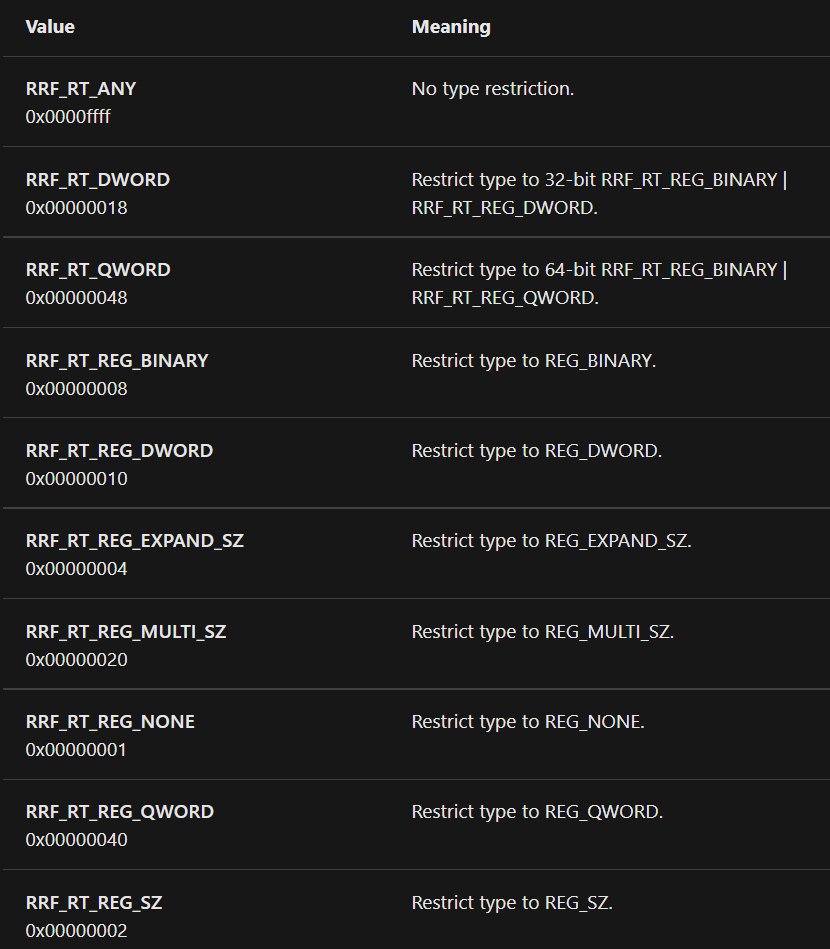
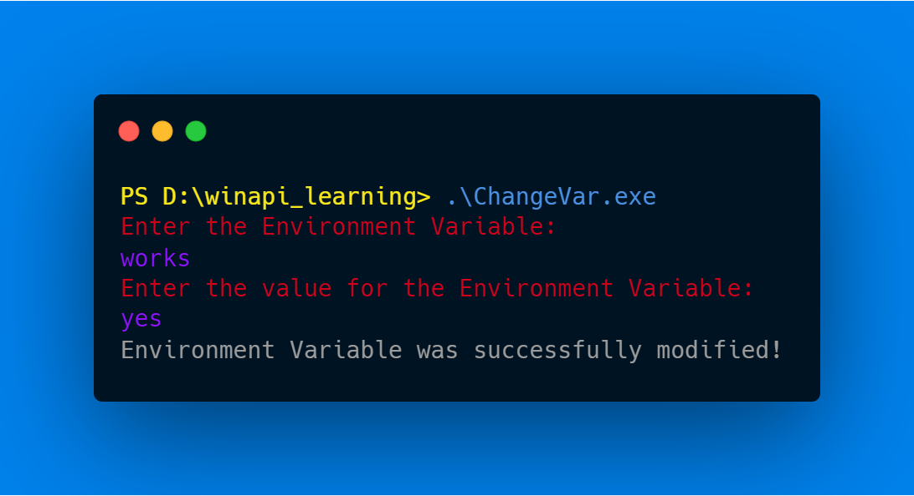
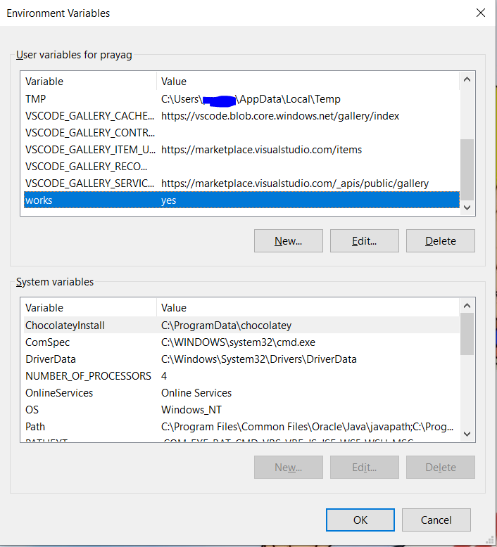

In this blog, we are going to have a look at some Windows API's Windows Registry Functions that will help us to manipulate the data inside the Windows Registry and as we know that our Environment Variables reside inside Windows Registry, so it will also help us to modify the Environment Variables in our system.

The three functions that we are going to use are `RegCreateKey`, `RegSetValueEx`, `RegGetValueA`. This functions are from the `winreg.h` header file.

# Some Important terms of The Windows Registry

As we are going to manipulate the Windows Registry using Windows API functions, we will understand some important terms of the Windows Registry.

The first things you should know about is `Keys`, `SubKeys` and `Values`.

You can understand them from the following example:


In our case, the path of the registry key where the User Environment Variables are stored is `HKEY_CURRENT_USER\Environment`. Here `HKEY_CURRENT_USER` is the Key, `Environment` is the `Sub Key` and all the Environment Variables inside the registry `Key` are the `Values`.


If you want to learn about Windows Registry, you can read some stuff here: 

[Windows registry for advanced users - Windows Server](https://docs.microsoft.com/en-us/troubleshoot/windows-server/performance/windows-registry-advanced-users)

# 1. RegCreateKey

This Function is used to Create a Registry Key. It opens the Registry Key if it already exists.

The Function's signature looks like this:

```c
LSTATUS RegCreateKeyA(
  HKEY   hKey,
  LPCSTR lpSubKey,
  PHKEY  phkResult
);
```

The return type of this function is `LPSTATUS`, which means it just returns a `long` integer which is an error code.

The first parameter for this function is `hKey` which is of `HKEY` data type. The `HKEY` data type is just a `HANDLE` to an open registry key.

If we don't have a `HANDLE`, we can use this predefined keys:

- HKEY_CLASSES_ROOT
- HKEY_CURRENT_CONFIG
- HKEY_CURRENT_USER
- HKEY_LOCAL_MACHINE
- HKEY_USERS

The second parameter of this function is `lpSubKey` of `LPCSTR` data type, which is just a `const char` pointer to the string that contains the name of the `Sub Key` that we want to Create / Open. 

The last and third argument is `phkResult`, this argument will contain the pointer to a variable which will receive the `HANDLE` of the registry `Key` that this function will Create / Open. This variable will be of type `HKEY`.

This function return `ERROR_SUCCESS` if it succeeds. 

If the function fails, the return value is a nonzero error code defined in `winerror.h`.

# 2. RegSetValueEx

This function is used to modify a registry `Value` after opening a `HANDLE` of it.

The function syntax looks like this:

```c
LSTATUS RegSetValueExA(
  HKEY       hKey,
  LPCSTR     lpValueName,
  DWORD      Reserved,
  DWORD      dwType,
  const BYTE *lpData,
  DWORD      cbData
);
```

The return type of this function is same as the last one.

The first parameter is `hKey` and this will be the handle to an Open registry `Key`. This `HANDLE` will be returned by `RegCreateKey` function(in our case).

The second parameter is `lpValueName`, the data type of this function is `LPCSTR` which is just a pointer to a char array. This parameter stores the Name of the `Value` that you want to change in The Registry. In our case, this will be the name of the Environment Variable that we want to modify.

The third parameter is `Reserved`, it's a reserved parameter and we are supposed to leave it as 0.

The fourth parameter is `dwType`. This parameter contains the type of data pointer by the `lpData` parameter. This type should be `REG_SZ`, as we just want to store a null-terminated string as the value of `REG_SZ`. You can read about every type here: 

[Registry Value Types - Win32 apps](https://docs.microsoft.com/en-us/windows/win32/sysinfo/registry-value-types)

The fifth parameter is `lpData`. This variable contains the string that we want to store into our Registry `Value`. This string should be a null-terminated string.

If you are going to choose the `REG_MULTI_SZ` type, the string must be terminated with two null characters.

The sixth parameter is `cbData`. This parameter contains the size of the string in the fifth argument plus the size of the null-terminator which will be 1.

This function return `ERROR_SUCCESS` if it succeeds. 

If the function fails, the return value is a nonzero error code defined in `winerror.h`.

# 3. RegGetValueA

Our next and last function is `RegGetValueA`. We use this function to read the data stored in a `Value`.

The function signature looks like this:

```c
LSTATUS RegGetValueA(
  HKEY    hkey,
  LPCSTR  lpSubKey,
  LPCSTR  lpValue,
  DWORD   dwFlags,
  LPDWORD pdwType,
  PVOID   pvData,
  LPDWORD pcbData
);
```

The first parameter is `hkey`. It's same as the first parameter in the last function.

The second parameter is `lpSubKey`. This parameter is used to pass the `Sub Key` name whose `Value` we want to access.

Because we want to access the Environment variables, we will use `Environment` as the argument to this function.

The third parameter is `lpValue`. This parameter is used to pass the name of the `Value` whose data we want to query. This will be the name of our Environment variable whose data we want to query.

The fourth parameter is `dwFlags`. This parameter is used to pass the data type of the `Value` ****that we want to access.

This are the available options for this parameteter:



The fifth parameter is `pdwType`. This parameter is used to pass a pointer to a variable which will get the data type of the data stored in the `Value` that we are accessing. This parameter is mostly used for verifying the data type that the function returned. We can just ignore the use of this function by passing `NULL` as an argument to this function.

The sixth parameter is **`pvData`.** This parameter is used to pass a pointer to a variable that will store the data from the Registry value. We can also pass `NULL` as an argument incase we just want to check if the registry value exists or not. This all will make sense later if it doesn't right now.

The seventh parameter is `pcbData`. This parameter is used to pass a pointer to variable that will store the size of the buffer pointed by `pvData` parameter. We can also pass `NULL` as an argument in this function. This parameter can only be `NULL` if the `pvData` parameter is `NULL`.

If the function succeeds, the return value is ERROR_SUCCESS.

If the function fails, the return value is a [system error code](https://docs.microsoft.com/en-us/windows/desktop/Debug/system-error-codes).

# Code Example

As said in the last blog post, we will be making a wrapper that will modify Environment variables for us.

Here's the code of the one that I made:

```c
#include <stdio.h>
#include <stdlib.h>
#include <windows.h>

// defining status values to use later in the functions. You can modify them on your own.
#define STATUS_UNSUCCESSFUL 0x00000001
#define STATUS_SUCCESS 0x00000000 

// Predefining our wrapper function.
NTSTATUS SetEnvironmentVariableR(LPCSTR lpName, LPCSTR lpValue);

int main(int argc, char* argv[]){
    char lpName[500]; // this variable will store the name of the environment variable.
    char lpValue[500]; // this variable will store the value of the environment variable.

    // We are going to ask the user for the name of the environment variable.    
    puts("Enter the Environment Variable: ");
    scanf("%s", &lpName);
    getchar(); // getchar to avoid a new line.
    puts("Enter the value for the Environment Variable: ");
    scanf("%[^\n]s", &lpValue);

    // calling our wrapper function.
    NTSTATUS Status = SetEnvironmentVariableR(lpName, lpValue);
       
    if (Status == STATUS_SUCCESS){ 
        printf("Environment Variable was successfully modified!");
    }

    return 0;
}

// function to set a environment variable globally by editing the registry keys.
NTSTATUS SetEnvironmentVariableR(LPCSTR lpName, LPCSTR lpValue){
    HKEY hKey; // this will hold the handle to the registry key.
    
    // We are going to open the registry key for HKEY_CURRENT_USER\Environment.
    RegCreateKey(HKEY_CURRENT_USER, "Environment", &hKey);
    
    // Error check.
    if (hKey == NULL) {
        printf("RegCreateKey failed\n");
        printf("Error code: %d", GetLastError());
        return STATUS_UNSUCCESSFUL;
    }

    // Now we are going to set the value of the environment variable.
    RegSetValueEx(hKey, lpName, 0, REG_SZ, lpValue, lstrlen(lpValue)+1);

    // Checking if the operation was successful by checking if the registry key actually exists.
    if (!RegGetValueA(hKey, "Environment", lpValue, RRF_RT_REG_SZ, NULL, NULL, NULL)){
        printf("RegSetValueEx unsuccessful!");
        printf("Error code: %d", GetLastError());
        return STATUS_UNSUCCESSFUL;
    }
    
    return STATUS_SUCCESS;
}
```

I feel like the comments are enough but I'm still going to make you understand everything!

First of all I defined some constants, I have used them as status codes later in the program. You can change them as you want.

Then I predefined our wrapper function, whose name is `SetEnvironmentVariableR`, the type of this function is `NTSTATUS` which means this function will return a status code.

The function signature looks like this:

```c
NTSTATUS SetEnvironmentVariableR(
	LPCSTR lpName,
	LPCSTR lpValue
);
```

The first parameter of this function is `lpName`. This parameter will be used to pass the name of the Environment variable that we want to modify.

The second parameter is `lpValue`. This parameter will be used to pass the value of the Environment variable that we want to store in `lpName`. 

The we move on the `main` function.

First we defined some variables to store our stuff and then we asked the user for input then we called our wrapper function.

Then in the `SetEnvironmentVariableR` function, I have first Initialized the `HANDLE` that we will use later, then I called the `RegCreateKey` function to open the `HANDLE` of the registry key at `HKEY_CURRENT_USER\Environment` by specifying `HKEY_CURRENT_USER` as the first argument and `Environment` as the second one.

Then after some error checking, I have called the `RegSetValueEx` function to set the value (Environment variable) from the user input to the string that the user specified.

And then I have called the `RegGetValueA` function to check if the Registry value that we just created exists or not. I tried to make a better error checking where I tried to check the value of the Environment Variable after updating it but because the Registry values will not get refreshed just after we change them.

In the end, we return `STATUS_SUCCESS` to tell the caller that the function was successful.

That was the explanation of the whole program, now let's run it and see how it looks in action!

# The result

Here is the output of the program where I gave `works` as the Variable name and `yes` as the value of the Environment Variable.

(Using a screenshot from [carbon.now.sh](http://carbon.now.sh) for better representation)



Now, Let's check the Environment Variable by searching "edit environment variable" in the Windows search and opening the application to see if there is a Environment Variable named `works`.



Perfect!, It works as expected :D

# Summary

In this blog, we learnt about basic registry terms such as `Keys`, `Sub Keys` and `Values`. We also learnt to use some of the Windows API functions that allows us to play with The Windows Registry.

The functions were:

1. `RegCreateKey`
2. `RegSetValueEx`
3. `RegGetValueA`

If you have read this blog till now, I hope you learnt something new from this blog post and I hope you will surely read the upcoming blogs too.

I thought of including the part where I play with the system environment variables too but that would have made the blog too large and boring. If you wanna play with them on yourself, you can just change the `HKEY_CURRENT_USER` to `HKEY_LOCAL_MACHINE` and make sure to run the program from administrator PowerShell or cmd.

That's all for this one, I'll meet you in the next one ;)
